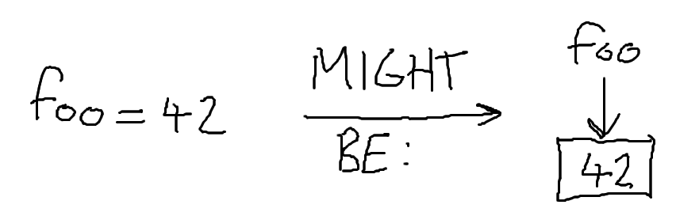

# Value Types

Consider this Python code:

    p = 1
    q = p
    q = 3
    print(p)  # Prints 1

    x = [1, 2]
    y = x
    y[0] = 3
    print(x[0])  # Prints 3

Now consider this JavaScript code:

    let p = 1;
    let q = p;
    q = 3;
    console.log(p);  // Prints 1

    let x = [1, 2];
    let y = x;
    y[0] = 3;
    console.log(x[0]);  // Prints 3

Now consider this C++ code:

    int p = 1;
    int q = p;
    q = 3;
    std::cout << p;  // Prints 1

    std::vector<int> x = {1, 2};
    std::vector<int> y = x;
    y[0] = 3;
    std::cout << x[0];  // Also prints 1

C++ disagrees with both Python and JavaScript. In fact, if you tried this same
example in Java, Scala, Lua, or dozens of other languages you would find that
most of them will print 3. Why is this?

The reason is to do with _value semantics_ and _reference semantics_. Python,
JavaScript, and many other languages use value semantics only for primitive
types, but use _reference semantics_ for compound types. In contrast, C++ has
value semantics for everything\* unless you _explicitly_ use a reference.

\* C-style arrays appear to break this rule, but std::array in C++ follows it.
I will go into more detail below.

## What are value/reference semantics?

To grasp this, we will take a moment to consider how our variables might be laid
out in memory. We will distinguish between the _variable_ and its _value_ by
writing the variable name with an arrow to a box containing the value:

The arrow from the `foo` to a box doesn't actually have to be a pointer in
memory. The variable name is only there for the humans; the compiler can just
deal with the boxes. For a more complicated type like arrays, this might look
more like:

Since we are using variable-sized arrays, we need to store the size of the array
somewhere, so the box pointed to by `my_array` contains the size. Then we must
store the values. If we were to store the values directly inside the first box,
we would have a problem: what if we try to add a new value but have run out of
space? We would have to create a new box and then `my_array` wouldn't be
pointing at it. Instead, we store the values in a second box and point to that
from the first one. This way, we can resize the second box cleverly without
disrupting the first one.

Now comes the distinction. What happens if we do `my_copy = my_array` with
value semantics, and what happens with reference semantics? With reference
semantics, we might see something like this:

Both variables point at the same box. This is very efficient, as we didn't
really have to do any work; we just made another variable that points at the
same thing. However because of this, if we try to edit one of the values stored
in `my_copy` we will edit the same data that `my_array` has.  The picture is
different if we use value semantics:

The two variables have entirely separate boxes. We have to actually perform
a _deep copy_ of the entire object when we do this assignment, but after we have
done this we can edit `my_copy` as much as we like without affecting `my_array`.

## What about C-style arrays?

In the example above, we are paying a price for every assignment we do. We have
to allocate two new boxes somewhere and then copy all the bits of data from the
source to the destination for each box. For this example, it is almost certainly
faster to have reference semantics.

C-style arrays do the simplest possible thing to avoid this cost: they try their
best not to exist. What I mean by this is that while it is perfectly valid to
write:

    int my_array[10];

It is not valid to write:

    int my_copy[10] = my_array;  // Won't compile.

This happens because when you try to use `my_array` after declaring it, it
almost always silently converts from an `int[10]` into an `int*` which points at
the first element. You can't assign a pointer to an array. In C, writing
`my_pointer[n]` roughly means:

> Assuming that `my_pointer` points to the first of at least `n` consecutive
> values which all have the same type as whatever `my_pointer` points to, return
> the `n`th one.

This means that almost every time you try to directly pass an array via an
assignment or as a function argument, it is actually being passed as a pointer
to an _unknown number of elements_. This gives the impression of reference
semantics, but with a few notable drawbacks:

    void Foo(int* data) {
      // sizeof(data) is sizeof(int*) which is probably 8 bytes on x86_64. The
      // information about the size of the array is lost.
      data[0] = 3;
    }

    int Bar() {
      int my_array[2] = {1, 2};
      // sizeof(my_array) is 2 * sizeof(int) because we know my_array is int[2].
      Foo(my_array);  // my_array becomes a pointer.
      return my_array[0];  // Returns 3.
    }

C++ has two alternatives that provide proper value semantics: `std::vector`
(which is a variable-sized array, unlike the C-style array) and `std::array`
(which is a fixed-size array like the C-style array):

    void FooVector(std::vector<int> data) {
      // data.size() is 2.
      data[0] = 3;
    }

    int BarVector() {
      std::vector<int> my_array = {1, 2};
      // sizeof(my_array) is meaningless.
      // my_array.size() is the number of elements.
      FooVector(my_array);  // my_array is copied.
      return my_array[0];  // Returns 1.
    }

    void FooArray(std::array<int, 2> data) {
      // sizeof(data) is 2 * sizeof(int).
      // data.size() is 2.
      data[0] = 3;
    }

    int BarArray() {
      std::array<int, 2> my_array = {1, 2};
      // sizeof(my_array) is 2 * sizeof(int).
      // my_array.size() is 2.
      FooArray(my_array);  // my_array is copied.
      return my_array[0];  // Returns 1.
    }

## Are value semantics ever faster?

Yes. For small types, it is often very wasteful to use reference semantics. This
is why languages like Python and JavaScript use value semantics for things like
numbers and booleans. However, it is often the case that you define your own
type which is small. In such cases, it is almost certainly faster to pass it by
value instead of passing it by reference. For example:

    struct MyInnerStruct {
      int value;
    };

    struct MyStruct {
      MyInnerStruct a, b;
    };

Take a moment to imagine what the equivalent of this would be in a language you
are familiar with. Now consider how an instance of this struct might be laid out
in memory if we have reference semantics for structs, versus if we have value
semantics for structs. This is how it might look:

Consider for a moment how much memory we might be using here. If we assume that
pointers are 8 bytes and integers are 4 bytes, then for Python and JavaScript
would be using two pointers and two ints across three boxes. That is a minimum
of 24 bytes. In contrast, the C++ code just has the two ints and requires only
8 bytes. That's 200% overhead for using reference semantics, and it only gets
worse if we add more levels of abstraction.

Now suppose we have a function which takes an instance of `MyStruct` as an
argument. If we pass by reference, we have to pass a pointer to the first box
into the function, requiring 8 bytes. Once we have passed it, we have to follow
two pointer hops to read the value of `my_struct.a.value`. If we instead pass by
value, we still only require 8 bytes, but now we have zero pointer hops to
access `my_struct.a.value` because we know that we can just look directly at the
bytes we were passed.

## Pointers? References?

C has one way to get reference semantics for functions: _pointers_. In C++ there
are also actual _reference_ types, but you can think of these as pointers which
look like values.

To pass a pointer to a value into a function, rather than passing the actual
value, you can use the unary prefix operator `&`. To access the value which
a pointer points at, you can use the unary prefix operator `*`:

    void Foo(int* p) {
      *p = 2;  // Assign 2 to the integer pointed to by p.
    }

    int Bar() {
      int x = 1;
      Foo(&x);  // Pass a pointer to x into Foo.
      return x;  // Returns 2.
    }

C++ reference types are more transparent when calling a function:

    void Foo(int& v) {
      v = 2;  // Assign 2 to the integer pointed to by the reference v.
    }

    int Bar() {
      int x = 1;
      Foo(x);  // Pass a reference to x into Foo.
      return x;  // Returns 2.
    }

This can be a blessing and a curse. On one hand, `const` references provide an
excellent way of avoiding expensive copies if you have a complicated value that
you want to pass to a function. The `const` is a promise from your function that
it will not modify the value it was passed, and indeed the compiler will enforce
this:

    void Foo(const int& v) {
      int x = v;  // Fine - only reading v.
      v = 2;  // Compile error.
    }

On the other hand, non-`const` references in unexpected places can make code
very hard to read. As a rule of thumb, try to avoid non-`const` references
unless you have a _very_ good reason to use them.

## Lifetime

Both Python and JavaScript are _garbage collected_ languages. This means that as
a programmer you are not responsible for making sure that memory resources that
you use are returned once you are done with them. Instead, the _garbage
collector_ does this for you by detecting whether a value is reachable through
any variables that are still present in the program. This relieves the
programmer of some cognitive burden, but there are costs. Garbage collection is
not free, and many garbage collecters suffer from either spontaneous pauses of
_multiple milliseconds_ at random times, or from requiring approximately 5-10
times as much memory to achieve reasonable performance.

C++ does not have garbage collection. The lifetime of your memory resources is
your responsibility as a programmer. Luckily, in all of the examples we have
covered so far, we have been using variables with _automatic storage duration_.
When we create variables in functions, the memory used by their values is
automatically reclaimed when the function returns. This is generally implemented
with a call stack, although that is neither guaranteed nor required by the
language standards:

    int Foo() {
      int x = 1;  // New variable allocated.
      return x;  // Value of x copied to return value.
    }  // x is deallocated.

However, this presents us with an issue: what happens if we return a pointer?

    int* Foo() {
      int x = 1;
      int* y = &x;  // Fine.
      return y;  // Pointer y is copied to return value.
    }  // x and y are deallocated.

    void Bar() {
      int* test = Foo();
      *test = 42;  // test points at where x used to be, but x is deallocated!
    }

This is bad. We have just assigned to memory that we have returned. This is
_undefined behaviour_ in C++. When you execute code which performs undefined
behaviour, the program is allowed to do _anything_. It could delete your files,
or email your drunk photos to your colleagues. Or it could segfault. Or it could
appear to work, but break when you run an optimized build instead of a debug
build. The latter two options are markedly more likely with popular compilers.

## Heap Allocation

The simplest workaround is not to return pointers to local variables, since this
will never work. However, there are things that you _can_ return pointers to.
You could return a pointer to a global variable, or you could return an object
which has _dynamic storage duration_:

    int* Foo() {
      int* x = new int;  // Allocate an int with dynamic storage duration.
      *x = 1;
      return x;  // pointer x is copied to return value.
    }  // x is deallocated but the value pointed to by x is not.

    void Bar() {
      int* value = Foo();  // The int pointed to by value is still valid.
      *value = 42;  // This is fine!
      delete value;  // Deallocate the int pointed to by value.
      *value = 1;  // This is undefined behaviour.
    }

Perhaps it is not clear why this is useful immediately, but an example which has
more immediately obvious use is allocation of arrays with a size that isn't
known at compile time:

    int* MakeIntArray(int n) {
      return new int[size];  // Create a new array of n ints.
    }

    void Bar(int n) {
      int* my_array = MakeIntArray(n);
      for (int i = 0; i < n; i++) {
        my_array[i] = i;
      }
      delete[] my_array;  // Note that we use delete[] for an array, not delete.
    }

If we forget to `delete` something which we previously created with `new`, the
memory which we allocated is _leaked_. What this means is that it is unreachable
from our program (because we don't have any way to access it any more) but we
can't reuse the memory because the system thinks we are using it. This memory is
now wasted until our program exits and the operating system reclaims all of the
resources that the program was using. Obviously this is bad, and we should try
to avoid doing it, but it is worse if we `delete` something that was not made
with `new`, or even if we `delete` something which we already `delete`d. Either
of these would invoke undefined behaviour and would probably crash our program.

In C, there is a similar but incompatible way to allocate memory: `malloc` and
`free`. I won't cover these functions because although you can, you should not
use them in C++.

## Ownership

Using `new` and `delete` is difficult to get right, especially if you are not
used to having to deal with them. One of the core concepts that is useful in
moderating variables with dynamic storage duration is the concept of
_ownership_. The principle is that whenever you have a pointer variable, you
should be aware of whether that variable _owns_ the value which it points to or
not. If it _does not_ own the value, the programmer can simply forget about the
value when the variable goes out of scope, because it is not their
responsibility. If the variable _does_ own the value, then when it is finished
with the programmer should make sure to `delete` the value.

You will often see comments by definitions for pointers or functions that take
or return pointers which will indicate whether the pointers carry ownership of
the value they refer to. These comments make it much easier to come to terms
with unfamiliar code. However, modern C++ has a much better alternative for
managing ownership of values: [smart pointers](smart-pointers.md).
